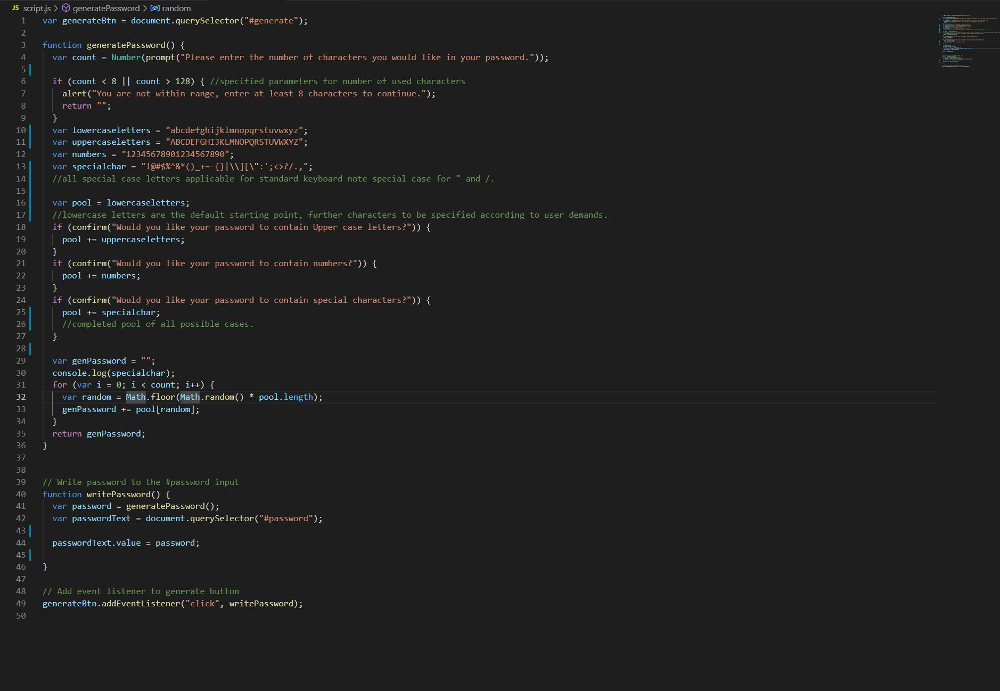
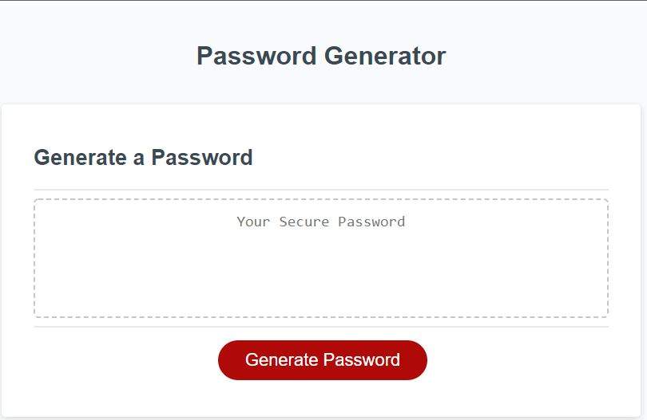
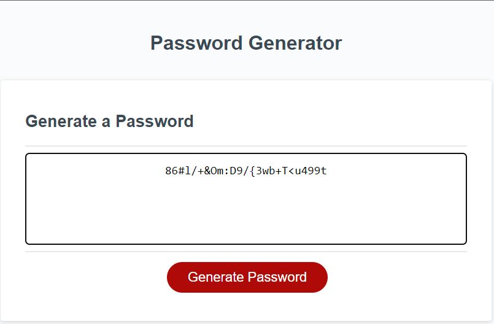

# 03 JavaScript: Password Generator

## DESCRIPTION

This is a tool that can be used to generate a password from 8 to 128 characters in length. It can be adjusted to allow a user to specify the use of upper and lower case characters, along with special characters and numbers. The user is guided through this process in an easy to follow step-by-step process that finishes by generating a unique password with every use. 

### CODE EXAMPLE

### STARTING SCREEN

### GENERATED PASSWORD

## DEPLOYED WEBSITE

https://felix1805.github.io/password-generator/